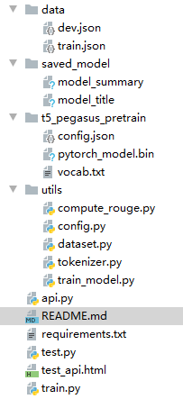

# 中文文本标题摘要生成模型
基于T5-pegasus中文模型的标题生成，摘要生成

##**运行环境：**  

1. 所需Python库  
    - Flask==2.1.2  
    - jieba==0.42.1  
    - numpy==1.21.6
    - rouge==1.0.1
    - torch==1.8.0
    - tqdm==4.64.0  
    - transformers==4.15.0
2. 数据集下载：

    百度网盘：https://pan.baidu.com/s/1dbEphiEIQVq6DnyQfCqtug?pwd=l4f4 提取码：l4f4 
    
    将下载好的数据集json文件放在data文件夹下
    
3. 预训练模型下载：

    百度网盘：https://pan.baidu.com/s/1yUfI2_aAEyHiJ92i7_lxug?pwd=xdzh 提取码：xdzh 
    
    将下载的预训练模型放在t5_pegasus_pretrain目录下

4. 训练好的模型参数下载：

    百度网盘：https://pan.baidu.com/s/12EqdXB3os-1Yr6b5UxM8Lg?pwd=ex7s 提取码：ex7s
    
    将下载的模型放在save_model目录下
    
5. 训练参数：

    修改utils/config.py中的训练参数

##**目录结构：** 



##**命令：** 

   - 训练
        ```bash
        python train.py
        ```
   - 测试
        ```bash
        python test.py
        ```
   - 使用API调用服务
        ```bash
        python api.py
        ```
        通过http发送post请求访问http://127.0.0.1:8999/generate 接口，将文本内容用参数content传递

##**生成效果：** 

    文章内容：在吉林梨树县，要求“一定要采取有效措施，保护好黑土地这一‘耕地中的大熊猫’”；在宁夏贺兰县，称赞稻渔空间乡村生态观光园“水资源利用效率提高了，附加值也上来了”；在山西太原，叮嘱坚持治山、治水、治气、治城一体推进，持续用力，再现“锦绣太原城”的盛景……近期，习近平总书记每到一地考察调研，绿色发展都是一项重要内容。把绿水青山变成金山银山，是总书记的关切，也是各地生动的发展实践。“绿水青山就是金山银山”的理念，从提出到现在已经15年了。这一历久弥新的理念，随着时代车轮滚滚向前，愈益彰显出强大的生命力。这一理念的创造性就在于，它不是用排他性的眼光来看待经济发展和环境保护之间的关系，而是在绿水青山和金山银山之间打开一条通道，指出了一种兼顾经济与生态、开发与保护的发展新路径。一段时间里，一些地方要么走“先污染，后治理”的老路，要么片面追求环保、干脆不搞经济发展了。这两种做法都是在绿水青山与金山银山之间做单项选择，都是不可取的。强调“绿水青山就是金山银山”，就是要尽最大可能维持经济发展与生态环境之间的精细平衡，走生态优先、绿色发展的路子，形成包括绿色消费、绿色生产、绿色流通、绿色金融等在内的完整绿色经济体系。实际上，放在现实语境中来看，经济发展与生态环保完全可以实现相互促进、彼此提升。以山西为例，该省围绕自身生态环境做起绿色发展大文章。
    原始标题：绿水青山就是金山银山
    生成标题：把绿水青山变成金山银山
    生成摘要：把绿水青山变成金山银山，是总书记的关切，也是各地生动的发展实践。
    -----------------------------------------
    文章内容：“以戒为固，以怠为败”，习近平总书记曾引用这句古语，生动阐明纠“四风”要常抓不懈的深刻道理。对于各级领导干部而言，这个道理在党性修养上也很适用。从正风反腐刮骨疗毒的“遭遇战”，到织密织牢制度之网的“阻击战”，再到构筑不想腐堤坝的“持久战”，5年来全面从严治党形成了强大的震撼效应，反腐败斗争压倒性态势已经形成并巩固发展。“剧是必须从序幕开始的，但序幕还不是高潮。”现在，全面从严治党已经来到了乘势而上夺取反腐败斗争压倒性胜利的新阶段。形势若船至中流，一篙松劲就会前功尽弃。任务如离弦之箭，飞向靶心是唯一的选择。如果说时间是我们的优势，那么成全这种优势的，必是坚持不懈的品质。当此之际，我们尤需谨记“以怠为败”的良训。“以怠为败”，着眼点在于廉政风险需要时时刻刻防范。有人说得好：“廉洁就像过独木桥，每一步都要很小心。”一时清廉，不等于永远清廉，现在是“政治上的明白人”，不等于将来永远是“政治上的明白人”，位高权重也并不意味着党性觉悟自然提高增强。试看那些落马官员的从政经历，不少人都有着廉吏能士向贪官佞人不断滑落的相似轨迹，都有着久居权位修身松弛、党性怠惰的相似诱因。从一定程度上看，为官的确“不易”，这种“不易”更强调一种风险意味，处处是诱惑陷阱，时时可能触发廉政风险。“管党治党一刻不能松懈”，修身慎行、怀德自重、清廉自守同样没有暂停键，谁也不能有松口气、歇歇脚的想法。“以怠为败”，关键点在于坚定党性、提高觉悟永远没有尽头。官清则身轻，自律则自由。这个道理并不难理解，却经常难兑现。党风廉政建设，归根到底是一场价值观上“以廉为荣”还是“以贪为荣”的较量。“看不见硝烟的战争”，这个适用于反腐败斗争的表述，同样适用于领导干部灵魂深处的廉贪较量。全面从严治党越是往深处推进，越需要触动思想灵魂发生“化学反应”，让党内政治生活原则和党的理想信念要求融入心灵、化为自觉追求。尤其是，党性上的学思践悟是一个循环往复、螺旋上升的过程，一丝不苟才能一尘不染，一心一意才能一往无前。打任何折扣、耍任何小聪明，到头来只会“船到江心补漏迟”，徒使自己的党性受损。“人人自有定盘针，万化根源总在心。”降低腐败问题和不正之风的发生几率，既仰赖于提高腐败行为和不正之风受惩罚的几率，也仰赖于降低党员干部内心中私欲杂念蔓发的可能。化用儒家思想中“闻见之知”和“德性之知”的说法，乘势而上巩固全面从严治党的成果，需要领导干部把从学习和实践中获得的“闻见之知”，同共产党人崇清尚廉的“德性之知”交融起来，持续加压淬火冶炼，才能让思想灵魂里清气常驻、党性永固。一位美学家概括了人生四种境界，从低到高分别为欲求境界、求知境界、道德境界、审美境界。古人的“心安茅屋稳，性定菜根香”，革命先辈的“行经万里身犹健，历尽千艰胆未寒”，都可以视作人生的“审美境界”。持之以恒地严格自律、修养党性，强化“四个意识”“四个自信”，必能达到共产党人的“审美境界”，成为一名彻底的马克思主义者。
    原始标题：党性修养当“以怠为败”
    生成标题：“以怠为败”是治国安邦的良训
    生成摘要：看不见硝烟的战争，这个适用于反腐败斗争的表述，同样适用于领导干部灵魂深处的廉贪较量。
    -----------------------------------------
    文章内容：世界潮流，浩浩荡荡，顺之则昌，逆之则亡。“面对复杂变化的世界，人类社会向何处去？亚洲前途在哪里？”在博鳌亚洲论坛上，习近平主席提出这些“时代之问”，深刻分析世界大势和时代潮流，明确提出共创和平、安宁、繁荣、开放、美丽的亚洲和世界的中国方案，充分彰显了大国领袖的宽广胸襟、深邃目光和历史担当，赢得与会嘉宾高度认同，引起国际社会对“时代之问”的广泛思考。求解“时代之问”，最根本的就是要把握历史规律，认清世界大势，顺应时代潮流。当今世界，什么是滚滚向前的潮流和大势？习近平主席在主旨演讲中给出了三个关键词：和平合作、开放融通、变革创新。放眼今日全球，和平与发展是世界各国人民的共同心声，冷战思维、零和博弈愈发陈旧落伍，妄自尊大或独善其身只能四处碰壁；世界已经成为你中有我、我中有你的地球村，各国经济社会发展日益相互联系、相互影响，推进互联互通、加快融合发展才能促进共同繁荣发展；变革创新是推动人类社会向前发展的根本动力，谁排斥变革、谁拒绝创新，谁就会落后于时代，谁就会被历史淘汰。面对这样的世界大势，唯有因势而谋、应势而动、顺势而为，才能创造历史、成就未来。40年前，中国共产党作出改革开放的关键抉择，正是对世界大势的顺应，对时代潮流的把握。40年来，改革开放这场中国的第二次革命，深刻改变了中国，我们这个古老民族实现了从“赶上时代”到“引领时代”的伟大跨越；深刻影响了世界，中国始终成为世界和平的建设者、全球发展的贡献者、国际秩序的维护者。40年历史充分表明，中国改革开放之所以必然成功，也一定能够成功，根本原因就在于中国进行改革开放，顺应了中国人民要发展、要创新、要美好生活的历史要求，契合了世界各国人民要发展、要合作、要和平生活的时代潮流。在主旨演讲中，习近平主席提出一个鲜明论断：一个国家、一个民族要振兴，就必须在历史前进的逻辑中前进、在时代发展的潮流中发展。今天的世界，不稳定不确定因素依然很多、挑战前所未有、逆全球化趋向不断涌现。当此之际，是开放还是封闭，是前进还是后退，考验着人们的胸襟、眼界和智慧。越是在这样的时候，越要求我们在不畏浮云遮望眼中把握历史规律，在善于拨云见日中认清世界大势。尽管前进道路上可能会遇到这样那样的困难和挫折，尽管发展大潮中可能会出现这样那样的风险和挑战，但只要我们顺应潮流和大势，坚持开放共赢，勇于变革创新，就定能让亚洲和世界变得和平、安宁、繁荣、开放、美丽。“青山遮不住，毕竟东流去”。今天，没有哪个国家能够独自应对人类面临的各种挑战，也没有哪个国家能够退回到自我封闭的孤岛。顺应世界大势，同心协力、携手前行，努力构建人类命运共同体，亚洲和世界的未来一定更加美好。
    原始标题：把握历史规律认清世界大势
    生成标题：望海楼顺应世界大势和时代潮流
    生成摘要：顺应世界大势，同心协力、携手前行，努力构建人类命运共同体，亚洲和世界的未来一定更加美好。
    
**参考：** 
https://github.com/SunnyGJing/t5-pegasus-chinese